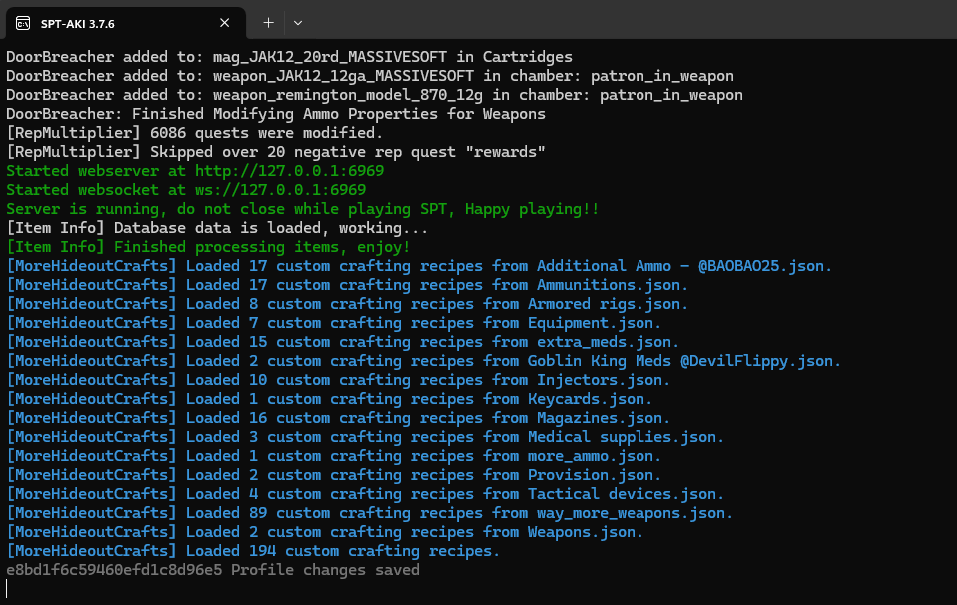
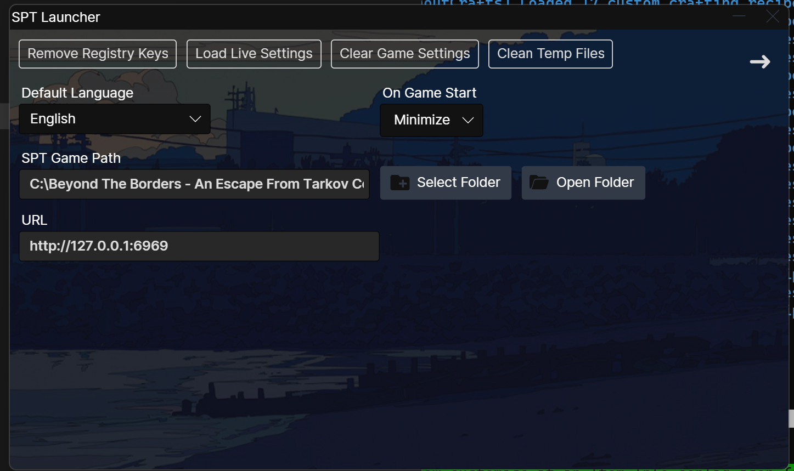

Usage
=====

.. _warning:

Warning
------------

The collection while it has a few customizable options is **NOT** designed to be modified. The smallest change ***as simple as changing pocket size*** has caused game breaking issues and profile loss. Because of this I will provide **ZERO** support for anyone who modifies the collection even the slightest and feedback will not be taken into consideration.

Those who alter the collection in any way and are discovered to have done so ***while still asking for help and/or lying*** about modifying the collection will be **permanently banned** from the discord. I put a lot of time into this collection and don't enjoy being taken advantage of or my free time being wasted. This collection is free, and I would like my time and person to be respected.

Keep in mind that a lot of these mods are altered **minimally to significantly** and do not function as they would normally due to this but function as I intend them to.

For now **DO NOT** build/upgrade both ***Med station & Water collector***. You can have **ONE** or the other but not both. This is due to an error thrown the breaks the game because of it. This is a priority one issue, but I have no idea when I will fix it. I suggest not building Water Collector but you are free to choose. This is an issue left behind from the previous mod author of Traveler in said mod which is now Wayferer and has significant changes made to it's locations, new ones added, etc.

**ALWAYS KEEP A BACK UP OF THE PREVIOUS GAME VERSION IN CASE YOU RUN INTO ERRORS/ISSUES IN THE NEW RELEASES**

.. _requirements:

Requirements
------------

`Net 6 Desktop Runtime <https://dotnet.microsoft.com/en-us/download/dotnet/thank-you/runtime-desktop-6.0.4-windows-x64-installer>`_

A **legitimate** copy of Escape From Tarkov.
Do NOT use WinRAR; it is known to cause issues. Use ``7Zip``

.. _howtosetup:

How to Setup
------------

1. Create a Beyond The Borders - Legacy Edition (3.7.6.) folder for use during installation/set-up (Must be created on your C:Drive).
2. `Install SPT <https://hub.sp-tarkov.com/files/file/672-spt-installer/>`_ (Single Player Tarkov) correctly in the created Beyond The Borders - Legacy Edition (3.7.6.) folder. Make sure to run the server & launcher at once before the next steps. Do not create a profile or copy live tarkov settings. Then close out of both server and launcher
3. Delete all the folders except for ``EscapeFromTarkov_Data`` , ``EscapeFromTarkov.exe``, ``EscapeFromTarkov_BE.exe``
4. Extract patcher (BtB-Patcher-3.7.6.7z) with 7zip ONLY into a separate folder. `Patcher <https://drive.google.com/file/d/10mXnFqAa-ktwFD64DWNU34ScWxUZ68I6/view?usp=sharing>`_
5. Copy the files inside the ``BtB-Patcher-3.7.6.7z`` newly extracted folder into the ``Beyond The Borders - Legacy Edition (3.7.6.) folder``.
6. Run the patcher.exe that is now inside the Beyond The Borders - Legacy Edition (3.7.6.) folder.
7. Once it has finished, delete the ``patcher.exe``.

.. _target to image:

.. _installation:

Installation
------------

1. `Download the collection <https://drive.google.com/file/d/1OgEBQ3LOx6Hn4jAkqDK3KcDAzj8bHjfG/view?usp=sharing>`_ (The mods that form this collection)
2. Extract the collection into the created Beyond The Borders - Legacy Edition (3.7.6.) folder. EXTRACT WITH 7-ZIP ONLY and replace any files when prompted.
3. Click Aki.Server.exe  and WAIT while it starts up. You will know when it is finished when you see this image below and the blue text has loaded:
4. After the server is finished loading and looks like the image above, open the Aki.Launcher.exe while keeping the server open.
5. You may run into an issue where upon trying to launch, it will give you an error on not being able to find the location of the EscapeFromTarkov.exe. This just means you need to reset the pathing in the launcher. Example image of said error:  
	-You can fix this by clicking on the settings at the top right of the launcher which will bring you to the image below. 
	-Click on Select Folder
	-Select the newly created Beyond The Borders - Legacy Edition (3.7.6.) folder.
	-The folder SHOULD look like this if you correctly followed instructions:
